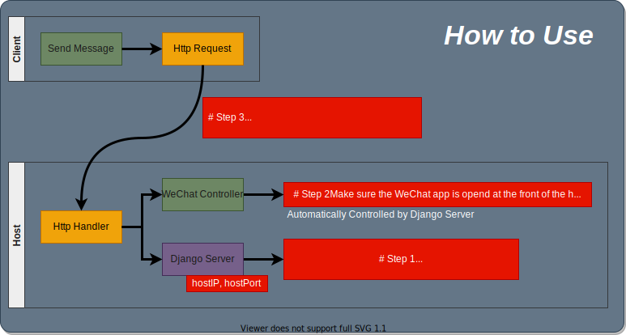

# Remote Controller

Control WeChat by Remote Socket Connection.

- [Remote Controller](#remote-controller)
  - [Sending Message](#sending-message)
  - [Socket Income Handler](#socket-income-handler)
  - [Keyboard Simulation](#keyboard-simulation)
  - [Requirements](#requirements)

## Sending Message

One command to send a message to the WeChat on the remote hosting machine.

```
http://{{hostIP}}:{{hostPort}}/submit/{{Message}}
```

The Project will work as following



## Socket Income Handler

The Django server is established to handle the income from the **http socket connection**.

The Django server is generated by the following python package

-   Django==3.2.5

The server can be started by running the commands

```sh
# On host machine

# CD to the folder of weChatController,
# it should contain the script of `manage.py`
cd weChatController

# Start the Django server,
# by specifying the hostIP and hostPort
python manage.py runserver {{hostIP}}:{{hostPort}}
```

## Keyboard Simulation

The weChat controlling is operated using the keyboard simulation.

THe simulation requires the following python packages:

-   keyboard==0.13.5
-   clipboard==0.0.4

The workflow is

1. The server receives the {{Message}};
2. The {{Message}} is copied to the system clipboard
    - by simulating press the Ctrl+c keyboard;
3. The {{Message}} is pasted to the WeChat App on the front
    - by simulating press the Ctrl+v keyboard;
    - nextly, the Enter keyboard is pressed to send the {{Message}}.

## Requirements

The Django server needs the following packages

-   Django==3.2.5
-   keyboard==0.13.5
-   clipboard==0.0.4

You may install them using following

```sh
pip3 install -r requirements.txt
```
